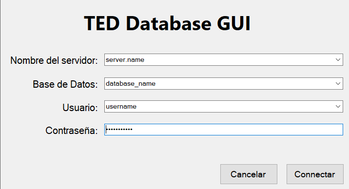

# TestDevelopmentDatabaseGUI

GUI application to access corporate databases and tables to dynamically search information of different types; text, numeric, bool and dates as well as create pdf or csv reports of the search results.

## Screenshots

### Login window:

### Main empty panel:

### Search panel:

### Search results

